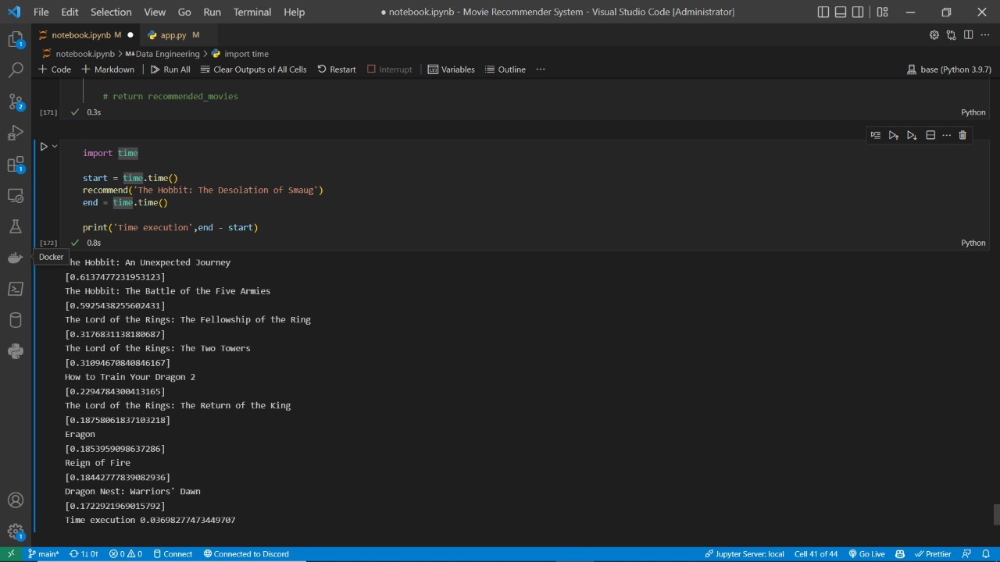
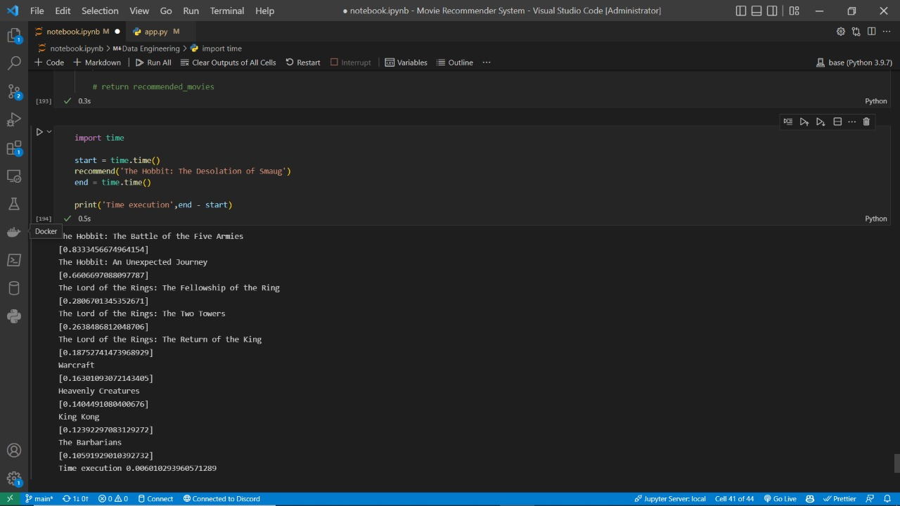

# Tutorial Project Movie Recommender System

Tutorial From [CampusX](https://www.youtube.com/watch?v=1xtrIEwY_zY&list=PLKnIA16_RmvY5eP91BGPa0vXUYmIdtfPQ&index=1)

Data from [Kaggle](https://www.kaggle.com/datasets/tmdb/tmdb-movie-metadata?select=tmdb_5000_movies.csv)

Deploy https://alrappie-mv-recommender.herokuapp.com/
___

## Types of Recommender Systems

### Content based
self based

### Collaborative filtering
user to user

### Hybrid
combining content based and collaborative filtering

___

movie['tags'] = movie['overview']+ movie['keywords'] + movie['genres'] + movie['cast'] + movie['crew']
from sklearn.feature_extraction.text import TfidfVectorizer
cv = TfidfVectorizer(max_features=10000)

movie['tags'] = movie['overview']+ movie['keywords'] + movie['genres'] + movie['cast'] + movie['crew']
from sklearn.feature_extraction.text import CountVectorizer
cv = CountVectorizer(max_features=10000)

movie['tags'] =  movie['keywords'] + movie['genres'] + movie['cast'] + movie['crew']
from sklearn.feature_extraction.text import TfidfVectorizer
cv = TfidfVectorizer(max_features=10000)

